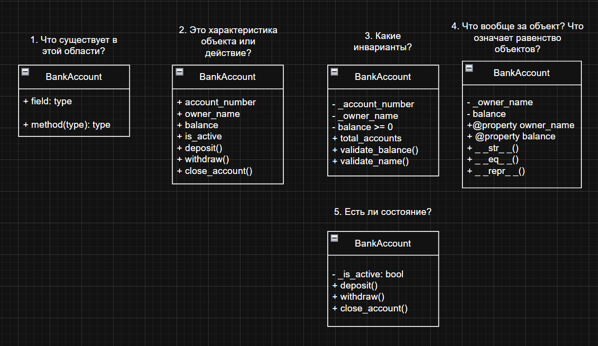

# Лабораторная работа №1 — Класс и инкапсуляция (Python 3.x)
## Банковский счет (Вариант 4) 


## Цель работы

- Освоить объявление пользовательских классов.
- Разобраться с инкапсуляцией (атрибуты экземпляра, закрытые поля).
- Реализовать свойства (`@property`).
- Переопределить магические методы (`__str__`, `__repr__`, `__eq__`).
- Осознать разницу между атрибутами класса и экземпляра.

---

## Идея

Создать "умный" банковский счет, который:

- **Сам следит за корректностью данных** (валидация номера счета, имени владельца и сумм).
- **Запрещает недопустимые действия** (например, нельзя пополнить или снять деньги с закрытого счета).
- **Предоставляет удобный интерфейс** через свойства (`@property`).

---

## Зарисовки в draw.io

Здесь представлена структура проекта и логика состояний объекта.


## Реализованный класс

### BankAccount

```python
class BankAccount:
    total_accounts = 0
```
Главный класс, моделирующий банковский счет. Содержит всю основную логику работы с объектом.

**Атрибуты класса:**
- `total_accounts` — общее количество созданных счетов.

**Атрибуты экземпляра: (Закрытые поля (Инкапсуляция)):**
- `_account_number` — номер счета.
- `_owner_name` — имя владельца.
- `_balance` — баланс.
- `_is_active` — статус активности.

---

## Валидация

Реализована в отдельном модуле `validate.py`:
- `validate_account_number()` — проверка формата номера.
- `validate_owner_name()` — проверка имени (длина, отсутствие цифр).
- `validate_balance()` — проверка на отрицательные значения.

---


## Бизнес-методы

Основные операции, которые описывают логику работы банковского счета:

- `deposit(amount)` — **Пополнение счета**. Метод проверяет, активен ли счет и является ли сумма положительной, прежде чем изменить баланс.
- `withdraw(amount)` — **Снятие средств**. Проверяет наличие достаточной суммы на счету и статус активности счета.
- `close_account()` — **Закрытие счета**. Меняет флаг `_is_active` на `False`. После этого любые финансовые операции по счету становятся невозможными.

---


## Магические методы

- `__init__` — инициализация и первичная валидация.
- `__str__` — дружелюбный вывод баланса для пользователя.
- `__repr__` — технический вывод для разработчика.
- `__eq__` — сравнение счетов по остатку на балансе.

---


## Свойства @property

- `account_number` — получение уникального номера счета.
- `owner_name` — чтение и безопасное изменение имени владельца (через setter).
- `balance` — получение текущего остатка (доступ только для чтения).
- `is_active` — получение текущего состояния счета (активен/закрыт).

*Позволяют безопасно работать с инкапсулированными данными.*

---

## Логика проектирования и технические решения

При разработке класса `BankAccount` были приняты следующие архитектурные решения:

### 1. Архитектура валидации (Инварианты)
Вместо того чтобы загромождать конструктор `__init__` проверками, вся логика валидации вынесена в отдельный модуль `validate.py`. 
* **Почему это важно:** Это позволяет повторно использовать функции проверки (например, при изменении имени через `setter`) и делает основной код класса чище.
* **Гарантия целостности:** Объект невозможно создать с отрицательным балансом или некорректным номером — программа выбросит исключение `ValueError` еще на стадии инициализации.

### 2. Применение инкапсуляции (Скрытые поля)
Все критические данные (`balance`, `account_number`, `is_active`) помечены префиксом `_` (protected).
* **Защита баланса:** У баланса отсутствует `setter`. Это осознанное решение — баланс должен меняться только через строго контролируемые методы `deposit` и `withdraw`, а не прямым присваиванием.
* **Контроль имени:** Свойство `owner_name` имеет и `getter`, и `setter`, так как банк позволяет сменить имя владельца, но только после повторной валидации.

---

## Подробное описание бизнес-методов

### Метод `withdraw(amount)` — Логика списания
Это наиболее сложный метод в классе, который выполняет трехступенчатую проверку:
1. **Проверка состояния:** Если счет имеет статус `_is_active = False`, операция блокируется.
2. **Валидация суммы:** Сумма списания должна быть положительным числом.
3. **Контроль лимитов:** Метод учитывает `_credit_limit`. Доступная сумма для снятия вычисляется как $balance + credit\_limit$. Если запрос превышает это значение, транзакция отклоняется.

### Метод `close_account()` — Управление жизненным циклом
Метод переводит объект в "терминальное" состояние.
* В отличие от простого удаления объекта, закрытие счета сохраняет его данные в системе для отчетности, но навсегда блокирует любые финансовые потоки. 
* Это реализует концепцию **"Мягкого удаления" (Soft Delete)**.

---

## Обработка исключений (Error Handling)

В проекте реализована активная защита от дурака (Fail-fast):
* Используются блоки `try-except` в `demo.py` для перехвата ошибок валидации.
* Каждое исключение снабжено понятным человекочитаемым сообщением (например, *"В имени '123' обнаружены цифры!"*), что упрощает отладку и использование программы.

---


## Сценарии тестирования (демонстрация работы)

В данном разделе представлены результаты выполнения 6 сценариев, подтверждающих корректность работы бизнес-логики и системы валидации.

### Сценарий 1: Создание объекта и вывод
Проверка работы конструктора, магических методов `__str__` и `__repr__`. 
- **Обновление**: Теперь система автоматически определяет процентную ставку и кредитный лимит в зависимости от типа счета (Обычный/Сберегательный).


### Сценарий 2: Сравнение объектов
Демонстрация работы магического метода `__eq__`.
- Счета сравниваются по текущему балансу. При изменении баланса одного из объектов результат сравнения динамически меняется с `True` на `False`.


### Сценарий 3: Setter и нормализация данных
Проверка безопасного изменения имени владельца через `@property.setter`.
- **Обновление**: Валидатор теперь выполняет автоматическую **нормализацию**: даже если имя введено строчными буквами (например, "марк"), система преобразует его в формат "Марк" с помощью метода `.title()`.


### Сценарий 4: Атрибуты класса
Демонстрация работы статического счетчика `total_accounts`.
- Счетчик корректно инкрементируется при создании каждого нового объекта (включая технические счета) и доступен как через класс, так и через любой экземпляр.


### Сценарий 5: Состояние объекта и ограничения
Проверка логики состояний (активен/закрыт).
- После вызова метода `close_account()` доступ к финансовым операциям (`deposit`, `withdraw`) блокируется. Система выбрасывает исключение `ValueError` с пояснением причины.


### Сценарий 6: Комплексная валидация (Try/Except)
Глубокая проверка защиты данных от некорректного ввода.
- **Имя**: Запрет на использование цифр в ФИО.
- **Номер**: Проверка минимальной длины (от 3 символов).
- **Баланс**: Контроль лимита задолженности (не ниже -10 000.0).


---

## Итог

В работе успешно реализованы:
- **Инкапсуляция** (скрытые поля с префиксом `_`).
- **Свойства и сеттеры** (контролируемый доступ к данным).
- **Валидация** (вынос логики проверок в отдельный модуль).
- **Управление состоянием** (зависимость методов от флага `_is_active`).