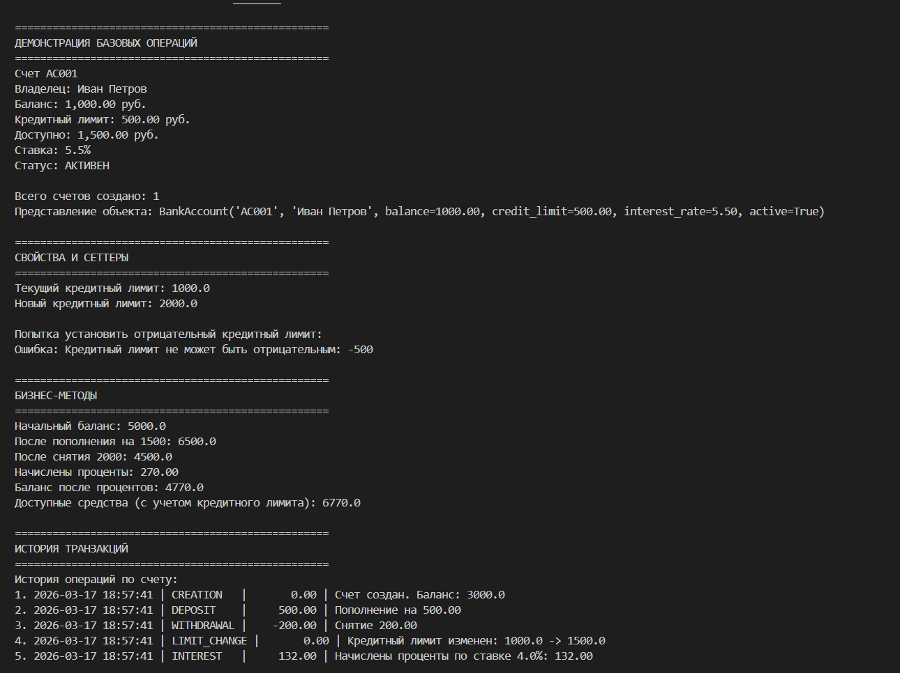
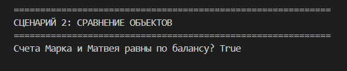
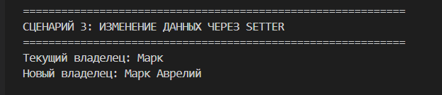
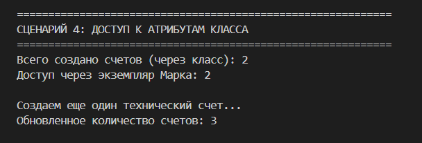
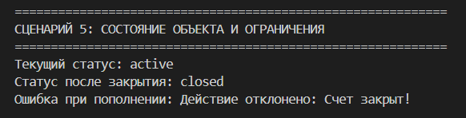
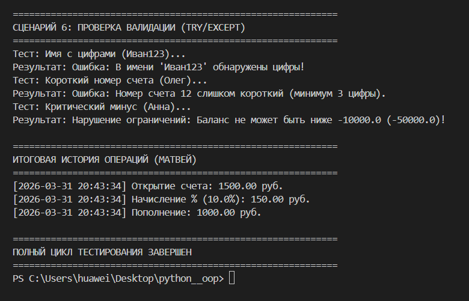

# Лабораторная работа №1 — Класс и инкапсуляция (Python 3.x)
## Банковский счет (Вариант 4) 

  

---

## Цель работы

- Освоить объявление пользовательских классов.
- Разобраться с инкапсуляцией (атрибуты экземпляра, закрытые поля).
- Реализовать свойства (`@property`).
- Переопределить магические методы (`__str__`, `__repr__`, `__eq__`).
- Осознать разницу между атрибутами класса и экземпляра.

---

## Идея

Создать "умный" банковский счет, который:

- **Сам следит за корректностью данных** (валидация номера счета, имени владельца и сумм).
- **Запрещает недопустимые действия** (например, нельзя пополнить или снять деньги с закрытого счета).
- **Предоставляет удобный интерфейс** через свойства (`@property`).

---

## Зарисовки в draw.io

Здесь представлена структура проекта и логика состояний объекта.

## Реализованный класс

### BankAccount

Главный класс, моделирующий банковский счет. Содержит всю основную логику работы с объектом.

**Атрибуты класса:**
- `total_accounts` — общее количество созданных счетов.

**Атрибуты экземпляра: (Закрытые поля (Инкапсуляция)):**
- `_account_number` — номер счета.
- `_owner_name` — имя владельца.
- `_balance` — баланс.
- `_is_active` — статус активности.

---

## Валидация

Реализована в отдельном модуле `validate.py`:
- `validate_account_number()` — проверка формата номера.
- `validate_owner_name()` — проверка имени (длина, отсутствие цифр).
- `validate_balance()` — проверка на отрицательные значения.

---

## Бизнес-методы

Основные операции, которые описывают логику работы банковского счета:

- `deposit(amount)` — **Пополнение счета**. Метод проверяет, активен ли счет и является ли сумма положительной, прежде чем изменить баланс.
- `withdraw(amount)` — **Снятие средств**. Проверяет наличие достаточной суммы на счету и статус активности счета.
- `close_account()` — **Закрытие счета**. Меняет флаг `_is_active` на `False`. После этого любые финансовые операции по счету становятся невозможными.

---

## Магические методы

- `__init__` — инициализация и первичная валидация.
- `__str__` — дружелюбный вывод баланса для пользователя.
- `__repr__` — технический вывод для разработчика.
- `__eq__` — сравнение счетов по остатку на балансе.

---

## Сценарии тестирования

### Сценарий 1: Создание и вывод

- Проверка работы конструктора и метода `__str__`.

### Сценарий 2: Сравнение объектов

- Работа метода `__eq__` (сравнение по балансу).

### Сценарий 3: Setter и валидация

- Проверка безопасного изменения имени владельца через сеттер.

### Сценарий 4: Атрибуты класса

- Демонстрация работы статического счетчика `total_accounts`.

### Сценарий 5: Состояние объекта

- Блокировка операций после закрытия счета (`close_account`).

### Сценарий 6: Ошибки создания

- Демонстрация работы `try-except` при неверных входных данных.

---

## Итог

В работе успешно реализованы:
- **Инкапсуляция** (скрытые поля с префиксом `_`).
- **Свойства и сеттеры** (контролируемый доступ к данным).
- **Валидация** (вынос логики проверок в отдельный модуль).
- **Управление состоянием** (зависимость методов от флага `_is_active`).