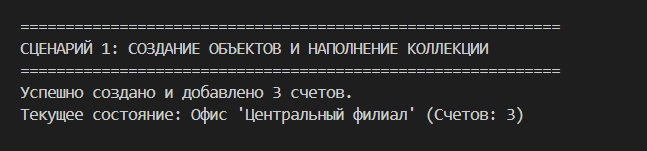
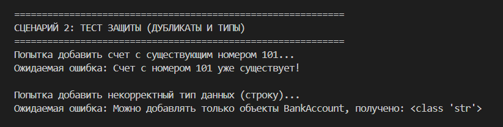
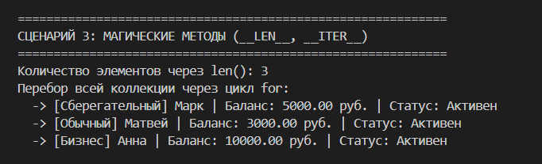
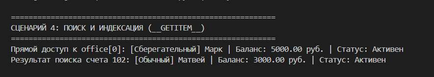
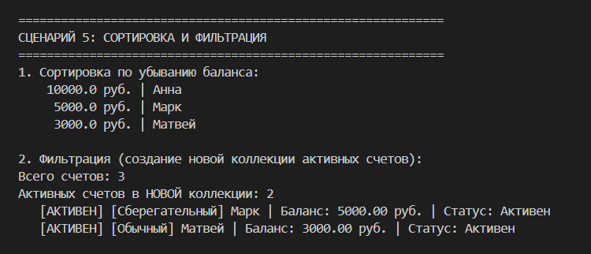
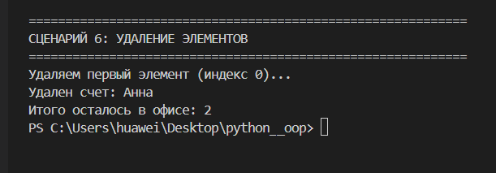

# Лабораторная работа №2 — Коллекция объектов (Python 3.x)
## Управление банковскими офисами (Вариант 4)

---

## Цель работы

- Научиться проектировать **классы-контейнеры** для агрегации объектов.
- Понять разницу между моделью сущности (`BankAccount`) и управляющей сущностью (`BankOffice`).
- Реализовать механизмы поиска, сортировки и фильтрации данных внутри коллекции.
- Освоить переопределение **магических методов** для работы с итерируемыми объектами (`__len__`, `__iter__`, `__getitem__`).

---

## Идея

Создать "умный" банковский офис, который выступает единой точкой управления для множества счетов:

- **Автоматизация**: Офис сам следит за тем, чтобы в системе не появилось два счета с одинаковым номером.
- **Безопасность**: Контейнер принимает только объекты класса `BankAccount`, защищая коллекцию от некорректных типов данных.
- **Гибкость**: Предоставляет интерфейс для анализа данных (поиск по ID, сортировка, фильтрация).

---

## Реализованный класс-контейнер

### BankOffice

Класс, представляющий собой агрегатор (контейнер) для объектов из ЛР-1.

**Атрибуты экземпляра:**
- `office_name` — название филиала/офиса.
- `_items` — **закрытый список** `[]` (инкапсулированное хранилище объектов `BankAccount`).

---

## Ключевые механизмы коллекции

### 1. Защита целостности данных
В методе `add(account)` реализована двойная проверка:
* **Type Checking**: Использование `isinstance()` гарантирует, что в список попадут только банковские счета.
* **Unique Constraint**: Перед добавлением система проверяет номер счета через `find_by_number`. Если номер уже зарегистрирован, выбрасывается `ValueError`.

### 2. Магические методы 
Для того чтобы офис вел себя как стандартный список Python, переопределены:
* `__len__` — поддержка функции `len(office)`.
* `__iter__` — поддержка циклов `for acc in office:`.
* `__getitem__` — доступ к элементам по индексу (например, `office[0]`).

### 3. Бизнес-логика и аналитика
* `find_by_number(number)` — поиск счета по уникальному идентификатору.
* `sort_by_balance(reverse=True)` — встроенная сортировка клиентов по остатку на балансе с помощью метода `.sort()` и lambda-выражения.
* `get_active_accounts()` — метод возвращает **новый экземпляр** класса `BankOffice`, содержащий только счета со статусом `is_active=True`.

---

## Сценарии тестирования (демонстрация работы)

Здесь представлены результаты выполнения сценариев из файла `demo.py`.

### Сценарий 1: Создание и наполнение
**Что происходит:** Инициализируется объект `BankOffice`. Создаются три различных счета (`BankAccount`) и успешно добавляются в коллекцию. Система выводит краткий отчет о создании офиса.

### Сценарий 2: Тест защиты (Дубликаты и Типы)
**Что происходит:** Проверяется надежность контейнера. При попытке добавить счет с уже существующим номером (`101`) или объект другого типа (например, строку), система перехватывает ошибку и выводит предупреждение.

### Сценарий 3: Магические методы
**Что происходит:** Демонстрируется удобство работы с коллекцией. Используется стандартная функция `len()` для получения размера и цикл `for` для последовательного вывода всех счетов.

### Сценарий 4: Поиск и индексация
**Что происходит:** Показывается возможность прямого доступа к данным. Мы извлекаем первый счет по индексу `[0]` и находим конкретный счет по его уникальному номеру `102`.

### Сценарий 5: Сортировка и фильтрация
**Что происходит:** Счета выстраиваются в порядке убывания баланса. Затем один из счетов закрывается, и создается **новая коллекция**, в которую попадают только оставшиеся активные счета. Это доказывает независимость отфильтрованных данных.

### Сценарий 6: Удаление элементов
**Что происходит:** Демонстрируется работа метода `remove_at()`. Из коллекции удаляется выбранный по индексу счет, после чего проверяется итоговое количество элементов в офисе.

---

## Итог

В работе успешно реализована **агрегация объектов**. Разделение логики на "Сущность" (Счет) и "Контейнер" (Офис) позволило создать масштабируемую структуру, соответствующую принципам ООП.