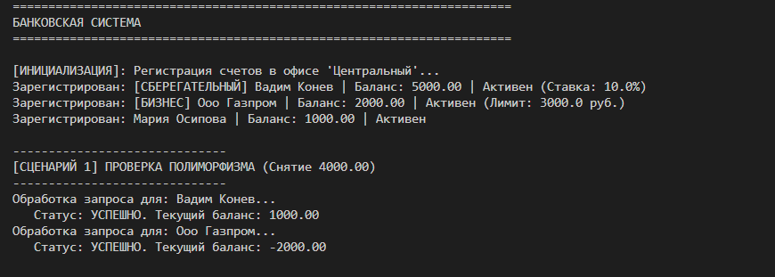
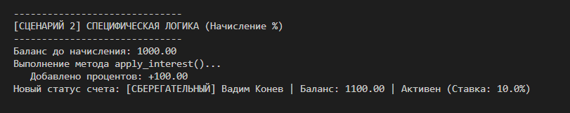
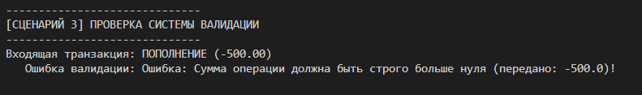
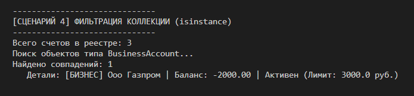
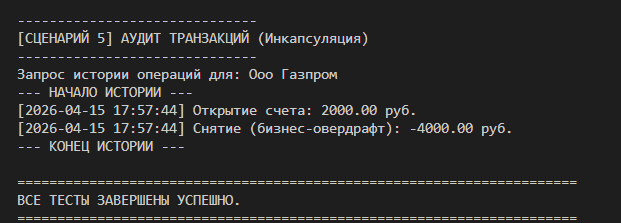

# Лабораторная работа: Наследование классов и принципы ООП (Банковская система)

## Теоретическая справка

**Наследование** — это механизм ООП, позволяющий описать новый класс на основе уже существующего (родительского, базового) класса. Класс-потомок (дочерний, производный) автоматически наследует все атрибуты и методы родителя, а также может добавлять свои собственные или переопределять существующие.

**Переопределение методов (Overriding)** — возможность дочернего класса изменить реализацию метода, унаследованного от базового класса, чтобы адаптировать его поведение под свои нужды.

**Полиморфизм** — принцип, позволяющий использовать объекты разных классов с одинаковым интерфейсом. Это способность объектов разных классов отвечать на один и тот же вызов метода по-своему. В данной работе полиморфизм демонстрируется через единый вызов метода `withdraw()` для разных типов счетов.

**super()** — встроенная функция, позволяющая вызывать методы родительского класса. Чаще всего используется в конструкторе `__init__` дочернего класса для инициализации унаследованных атрибутов, избегая дублирования кода родителя.

**isinstance(object, classinfo)** — функция для проверки, является ли объект экземпляром указанного класса или его потомком.

---

## Иерархия классов в работе

В рамках данной работы была разработана иерархия классов для моделирования банковской системы.

### Базовый класс `BankAccount`
Содержит общие атрибуты и методы для любого типа счета.

* **Атрибуты:** номер счета, имя владельца, баланс, статус (активен/закрыт), история транзакций.
* **Методы:** `deposit()` (пополнение), `withdraw()` (снятие - базовая логика), `get_history()` (получение выписки), `__str__()` (текстовое представление).

### Класс `SavingsAccount` (Сберегательный счет)
Наследует от `BankAccount`. Предназначен для хранения средств с начислением процентов.

* **Новые атрибуты:** `_interest_rate` (процентная ставка).
* **Новый метод:** `apply_interest()` — рассчитывает и начисляет годовые проценты на текущий баланс.
* **Переопределенный метод:** `__str__()` — добавляет информацию о типе счета.

### Класс `BusinessAccount` (Бизнес-счет)
Наследует от `BankAccount`. Предназначен для юридических лиц, допускает уход баланса в минус (овердрафт).

* **Новые атрибуты:** `_overdraft_limit` (лимит овердрафта).
* **Переопределенный метод:** `withdraw()` — изменяет логику снятия, позволяя использовать заемные средства в пределах установленного лимита.
* **Переопределенный метод:** `__str__()` — добавляет информацию о лимите овердрафта.

---

## Демонстрация работы (demo.py)

В скрипте `demo.py` реализовано 5 сценариев, последовательно демонстрирующих работу всех механизмов.

### [ИНИЦИАЛИЗАЦИЯ]: Создание объектов и базовая валидация
* **Действия:** Создаются экземпляры классов `SavingsAccount`, `BusinessAccount` и базового `BankAccount`. Объекты регистрируются в коллекции `BankOffice`.
* **Объяснение:** Мы видим, что конструкторы дочерних классов успешно вызывают конструктор родителя через `super()`, инициализируя общие поля.

### [СЦЕНАРИЙ 1]: Проверка полиморфизма (Снятие 4000.00)
* **Действия:** Для Сберегательного и Бизнес счета вызывается один и тот же метод `withdraw(4000.0)`.
* **Результат:** Сберегательный счет выполняет стандартное списание, а Бизнес-счет задействует овердрафт и уходит в минус.
* **Объяснение:** Это **чистый полиморфизм**. Один вызов метода приводит к разному поведению в зависимости от класса объекта.

### [СЦЕНАРИЙ 2]: Проверка специфической логики дочерних классов
* **Действия:** Для объекта `acc_s` (Сберегательный счет) вызывается уникальный метод `apply_interest()`.
* **Результат:** Баланс счета увеличивается на сумму начисленных процентов.
* **Объяснение:** Демонстрация расширения функциональности дочернего класса.

### [СЦЕНАРИЙ 3]: Тестирование системы валидации и инкапсуляции
* **Действия:** Попытка пополнить обычный счет на отрицательную сумму (`deposit(-500)`).
* **Результат:** Метод базового класса перехватывает некорректные данные и выбрасывает исключение `ValueError`.
* **Объяснение:** Демонстрация защиты данных (инкапсуляции).

### [СЦЕНАРИЙ 4]: Фильтрация коллекции и проверка типов (isinstance)
* **Действия:** Из общего списка всех счетов запрашиваются только счета типа `BusinessAccount`.
* **Результат:** Возвращается список, содержащий только бизнес-счета.
* **Объяснение:** Использование `isinstance()` для работы с коллекцией разнородных объектов.

### [СЦЕНАРИЙ 5]: Аудит транзакций и инкапсуляция истории
* **Действия:** Вызов метода `get_history()` для Бизнес-счета.
* **Результат:** Выводится детальный лог всех операций со счетом с указанием даты и времени.
* **Объяснение:** Демонстрация скрытия внутренней реализации хранения истории.

---

## Вывод

В ходе выполнения лабораторной работы была успешно разработана иерархия классов для моделирования банковской системы. Были успешно продемонстрированы механизмы наследования, переопределения методов, полиморфизма, инкапсуляции и работа с коллекцией объектов разных классов. Все поставленные цели достигнуты.