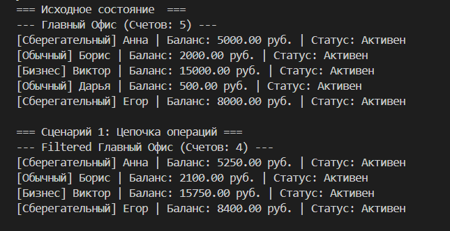
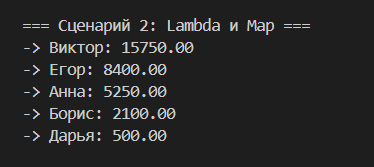
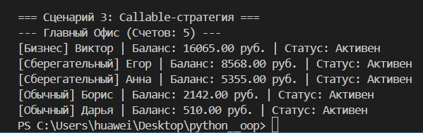

# Лабораторная работа №5: Функции как аргументы. Стратегии и делегаты

## Цель работы
Освоить функциональный стиль программирования в Python, научиться передавать функции как аргументы, применять встроенные функции высшего порядка (`map`, `filter`, `sorted`), реализовать паттерн «Стратегия» и интегрировать функциональный подход с объектно-ориентированным кодом.

## Функции высшего порядка (Higher-Order Functions)
Функция высшего порядка — это функция, которая:
*   Принимает другую функцию как аргумент, или
*   Возвращает функцию в качестве результата.

В данной лабораторной работе методами высшего порядка являются методы класса `BankOffice`: `sort_by`, `filter_by` и `apply`.

## Функции как объекты первого класса
В Python функции являются объектами первого класса, которые могут:
*   Присваиваться переменным
*   Передаваться как аргументы
*   Возвращаться из функций
*   Храниться в структурах данных

## Lambda-выражения (анонимные функции)
Lambda-функция — это небольшая анонимная функция, которая может содержать только одно выражение. Она создаётся с помощью ключевого слова `lambda`.
**Синтаксис:** `lambda аргументы: выражение`

## Встроенные функции высшего порядка

### `map(function, iterable)` — применение функции к каждому элементу
Функция `map()` применяет переданную функцию к каждому элементу итерируемого объекта и возвращает итератор с результатами. В проекте используется для получения текстовых сводок счетов.

### `filter(predicate, iterable)` — фильтрация элементов
Создаёт итератор из элементов, для которых функция-предикат возвращает `True`. Предикат можно передавать в метод `filter_by()`.

### `sorted(iterable, key=None, reverse=False)` — сортировка
Упорядочивает элементы коллекции по определенному правилу. Параметр `key` принимает функцию, возвращающую значение для сравнения.

## Паттерн «Стратегия» (Strategy Pattern)
Это поведенческий паттерн проектирования, который определяет семейство алгоритмов, инкапсулирует каждый из них и делает их взаимозаменяемыми. Стратегия позволяет изменять поведение объекта во время выполнения.

## Callable-объекты как стратегии
Python позволяет сделать объект вызываемым (callable), реализовав метод `__call__()`. Это позволяет создавать классы-стратегии с сохранением состояния. В работе реализован класс `InterestStrategy`.

## Метод `apply()`
Метод `apply(func)` применяет функцию ко всем элементам коллекции. Этот метод делает коллекцию гибкой: можно передать любую функцию для обработки элементов.

## Цепочки операций (Method Chaining)
Техника, при которой методы возвращают сам объект (`self`), что позволяет вызывать методы последовательно в одной строке.

## Фабрика функций (Function Factory)
Функция, которая создаёт и возвращает другую функцию с заданными параметрами. 
В работе реализована фабрика **`limit_filter(min_amount)`**, которая создает функции-предикаты для фильтрации счетов с балансом выше указанной суммы. Это позволяет динамически генерировать условия фильтрации без дублирования кода.

---

## Сценарии демонстрации

### Сценарий 1: Цепочка операций (Fluent Interface)
Демонстрирует совместное использование фильтрации, сортировки и применения стратегии.
1. **Фильтрация**: оставляем счета с балансом > 1000.
2. **Сортировка**: упорядочиваем по имени владельца.
3. **Применение**: начисляем процент через `InterestStrategy`.

### Сценарий 2: Lambda и Map
Использование анонимных функций для быстрой обработки данных.
1. **Сортировка через Lambda**: сортировка по убыванию баланса.
2. **Преобразование через Map**: формирование списка сводок.

### Сценарий 3: Паттерн «Стратегия» через callable-объекты
Демонстрация использования сложной логики начисления процентов, инкапсулированной в объект-стратегию.

## Вывод
В ходе выполнения лабораторной работы были изучены и применены на практике следующие концепции:
*   **Передача функций как аргументов**: реализована возможность гибкой настройки поведения методов коллекции через внешние функции-делегаты.
*   **Lambda, map, filter**: освоены инструменты функционального программирования для лаконичной фильтрации, сортировки и трансформации данных «на лету».
*   **Функции высшего порядка и замыкания**: реализована фабрика функций для динамического создания фильтров с заданными параметрами.
*   **Паттерн «Стратегия»**: изучен способ инкапсуляции алгоритмов в вызываемые (callable) объекты, что позволило интегрировать функциональный подход в объектно-ориентированную модель банковской системы.
*   **Fluent Interface**: реализованы цепочки вызовов (Method Chaining) для последовательной и читаемой обработки коллекции объектов.