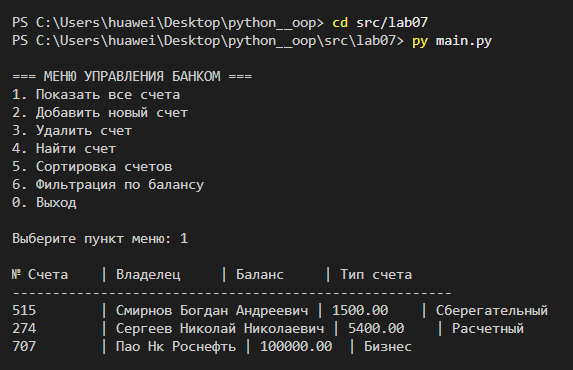
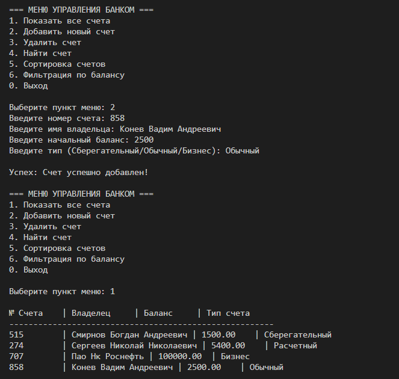
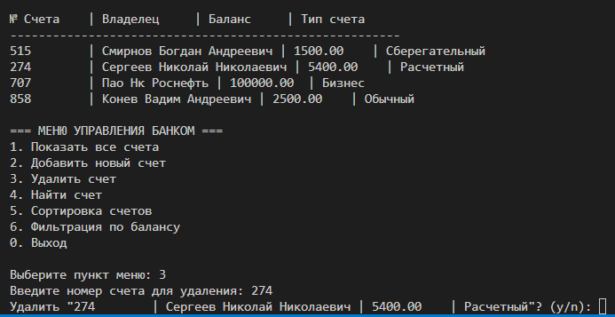
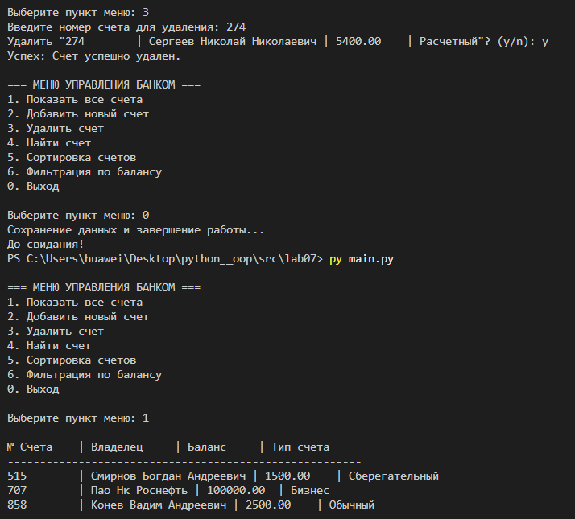
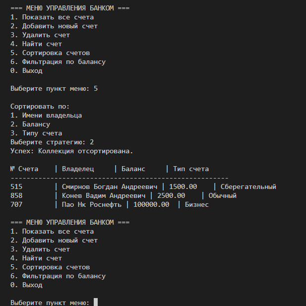
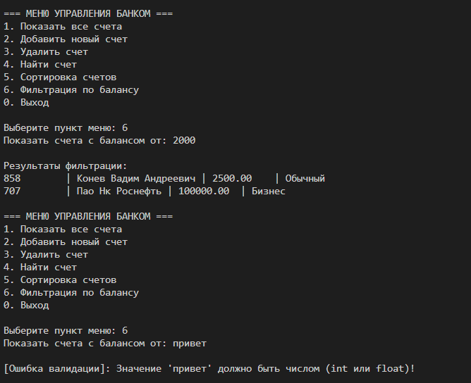

# ЛР-7 — Консольное приложение

## 1. Цель работы
* Объединить все знания, полученные в ЛР1–ЛР6, в единое работающее приложение.
* Реализовать интерактивный CLI-интерфейс с меню и вводом пользователя.

---

## 2. Структура проекта
В проекте реализована многомодульная структура с чётким разделением зон ответственности:

* **lab07/** — основная рабочая директория лабораторной работы.
  * `main.py` — главная точка входа, запускающая основной цикл консольного меню.
  * `app.py` — инициализация и общая конфигурация приложения.
  * `cli.py` — логика консольного интерфейса и взаимодействия с пользователем.
  * `collection.py` — управление оперативной коллекцией объектов.
  * `model.py` — описание базовых классов и логики сущностей банковских счетов.
  * `strategies.py` — модульная реализация алгоритмов сортировки (паттерн «Стратегия»).
  * `storage.py` — слой работы с файловой системой (сохранение и загрузка).
  * `validate.py` — функции сквозной проверки корректности пользовательского ввода.
  * `exceptions.py` — описание кастомных классов исключений.
  * `accounts_db.json` — база данных, содержащая коллекцию счетов в формате JSON.

---

## 3. Описание CLI

### Реализованные пункты меню
* **`1` Показать все счета**: форматированный вывод всей базы данных на экран в виде таблицы.
* **`2` Добавить новый счет**: интерактивное создание аккаунта с пошаговым вводом данных.
* **`3` Удалить счет**: удаление элемента по его уникальному идентификатору (ID).
* **`4` Найти счет**: быстрый точечный поиск счета владельца по ID.
* **`5` Сортировка счетов**: динамический выбор критерия сортировки коллекции в рантайме.
* **`6` Фильтрация по балансу**: отображение записей, проходящих по заданному числовому лимиту.
* **`0` Выход**: корректное завершение работы программы с сохранением состояния.

### Обработка ошибок ввода
Система полностью защищена от некорректных действий через блоки обработки исключений `try-except`. При передаче строк в числовые поля (например, баланс или ID) программа перехватывает исключение `ValueError`, выводит пользователю понятное предупреждение об ошибке валидации и плавно возвращает его в меню, предотвращая аварийное падение скрипта.

### Механизм сохранения и загрузки (для оценки 5)
* **Загрузка**: При старте `main.py` модуль управления считывает файл `accounts_db.json`, десериализует его содержимое и воссоздает объекты классов в оперативной памяти.
* **Сохранение**: Любые изменения коллекции происходят в памяти, а при выборе пункта меню `0` срабатывает триггер автоматического сохранения, перезаписывающий обновлённые данные обратно в файл `accounts_db.json`. Это обеспечивает персистентность данных между сессиями.

---

## Демонстрация работы

### Сценарий 1: Данные о счетах и методы интерфейса (Вывод базы)
При запуске приложения модуль управления обращается к слою `storage.py` для десериализации данных из JSON. На основе прочитанных записей динамически конструируются объекты классов из `model.py`. 

* **Вывод данных**: С помощью встроенных интерфейсных методов объекты переводятся в строковое представление для построения выровненной таблицы. 
* Наблюдается корректное отображение всех начальных атрибутов сущностей (уникальный ID, ФИО владельца, текущий баланс и тип банковского счета).

### Сценарий 2: Модификация коллекции (Интерактивное изменение)
Демонстрирует сквозной жизненный цикл изменения оперативной памяти приложения при работе с динамической коллекцией.

* **Добавление записи**: Пошаговый мастер CLI-интерфейса собирает строки и числовые параметры, валидирует их и передает в конструктор класса, добавляя новую бизнес-сущность в список.
* **Контроль изменений**: Повторный вызов метода отрисовки таблицы подтверждает успешную вставку элемента в общую коллекцию с сохранением правильной индексации.
* **Безопасное удаление**: Метод удаления по ID извлекает из коллекции целевой объект, берет его строковый атрибут `владелец` и выводит кастомный интерактивный запрос верификации. После ввода флага `y` элемент бесследно удаляется из массива.

### Сценарий 3: Паттерн «Стратегия» при работе со списками
Демонстрирует динамическое переключение алгоритмов упорядочивания внутри управляющего класса `collection.py` в режиме реального времени.

* **Подмена алгоритма**: Контекст сортировки не содержит жестко прописанного кода. При выборе пункта меню программа подставляет нужный класс-стратегию из модуля `strategies.py` (по имени, балансу или типу).
* На скриншоте зафиксировано применение алгоритма **сортировки по балансу** — коллекция мгновенно перестраивает цепочку элементов строго по возрастанию их числового значения.

### Сценарий 4: Фильтрация данных и стресс-тестирование валидации
Демонстрирует сопряженную работу алгоритмов фильтрации бизнес-логики и подсистемы перехвата критических исключений в пользовательском интерфейсе.

* **Фильтрация**: На основе переданного предиката (минимальная сумма) программа запускает цикл отбора записей, скрывая из итоговой таблицы все счета, не проходящие установленный лимит.
* **Валидация и try-except**: Ввод невалидных строковых данных (`привет`) вместо ожидаемого числового порога отсекается на этапе парсинга. Вместо аварийной остановки интерпретатора Python, сработавший блок `try-except` успешно ловит `ValueError`, гасит ошибку и выводит текстовое предупреждение, сохраняя стабильность программы.

---

## Вывод

В ходе выполнения лабораторной работы были изучены и применены на практике следующие концепции:

* **Разбиение на модули и слои**: архитектура проекта разделена на модель данных, бизнес-логику и представление, что обеспечивает слабую связность модулей.
* **CLI-интерфейс**: спроектировано и реализовано отказоустойчивое текстовое меню пользователя на базе бесконечного цикла обработки команд.
* **Обработка исключений**: освоены механизмы перехвата исключений, предотвращающие аварийное завершение процессов при невалидном вводе пользователя.
* **Работа с файлами и типизация (для оценки 5)**: реализовано постоянное сохранение состояния объектов во внешних файлах формата JSON, а также применена строгая типизация для безопасных расчетов внутри приложения.